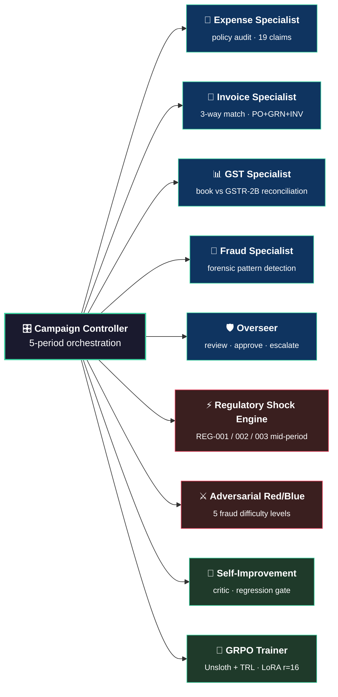
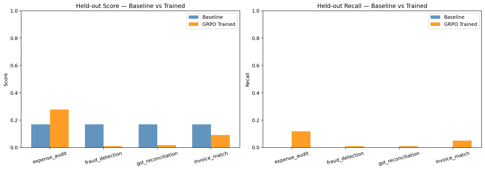
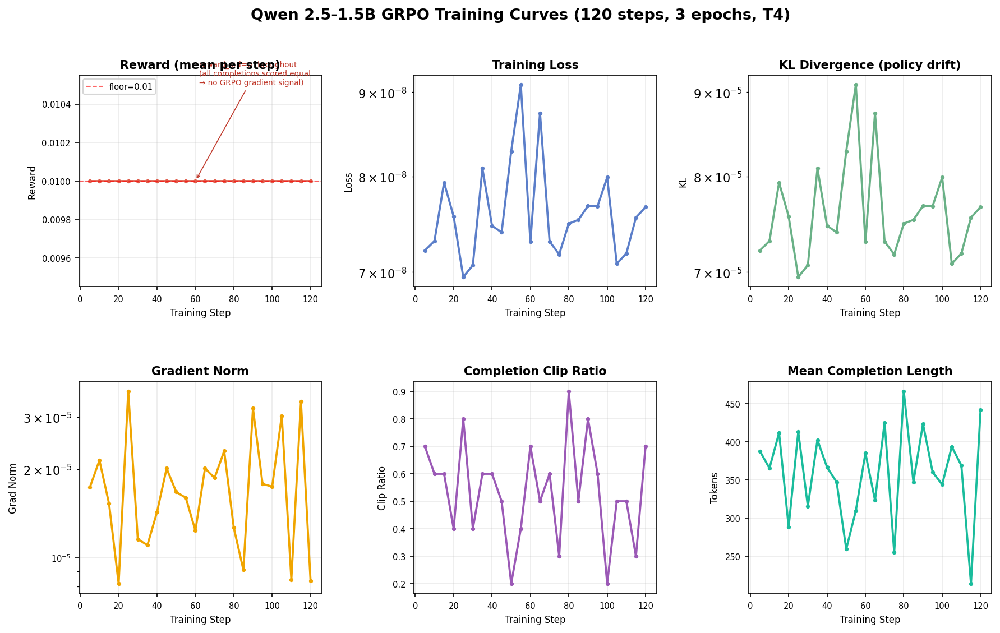

<h1 align="center">💰 Financial Audit Env</h1>
<h3 align="center"><em>A Multi-Agent Oversight Platform for Training Auditing LLMs</em></h3>


An OpenEnv-compatible reinforcement learning environment for training AI agents to audit financial documents through **multi-agent cooperation**, **regulatory adaptation**, and **self-improvement**. Built for the [Meta PyTorch Hackathon — Round 2](https://www.scaler.com/school-of-technology/meta-pytorch-hackathon).

> **Theme #3 World Modeling — #3.1 Professional Tasks** | Built with [OpenEnv v0.2.3+](https://github.com/meta-pytorch/OpenEnv) | Deployed on [HF Spaces](https://huggingface.co/spaces/balloonmann/financial_audit_env) | Training via [HF TRL GRPO](https://github.com/huggingface/trl) + Unsloth in [Colab](GRPO_Training_Submission_Final.ipynb)

**[Live API](https://balloonmann-financial-audit-env.hf.space/docs)** · **108 tests passing** · Blog: [BLOG.md](BLOG.md) · Notebook: [GRPO_Training_Submission_Final.ipynb](GRPO_Training_Submission_Final.ipynb)

---

## Environment Walkthrough: From Baseline to Regulatory Shock

**Act 1 — The Baseline.** Period 1. The agent receives 19 expense claims and a policy doc. Easy task, stable rules, F1 ≈ 0.12.

**Act 2 — The World Mutates.** Period 2. Meal limit jumps ₹1,500 → ₹2,000. A new vendor onboards. Cross-period memory is now required. The agent's internal model is stale unless it updates.

**Act 3 — The Regulatory Shock.** Period 3. Mid-audit, REG-001 drops: GST on IT services 18% → 12%. Schema drifts (`vendor_gstin` → `supplier_gstin`). Findings already submitted under the old rule. Baselines drop 15–20% here, exactly as designed.

**Act 4 — The Environment Reveals the Training Problem.** GRPO chases the densest reward signal. Llama 3.1 8B improved **3×** on expense audits and **collapsed 82%** on fraud detection. The 0.20 F1 floor multiplier kicked in. The environment said *no, this isn't a win* — and made the curriculum bias obvious.

A good environment doesn't hide training problems. It surfaces them so cleanly that the fix is obvious.

---

## Problem Statement

Most LLM tools for finance treat auditing as retrieval: "find the thing that violates the rule." This environment tests something harder: **Can an LLM maintain a consistent internal model of a financial world and UPDATE that model when ground truth shifts?**

Real audits run across multiple fiscal periods. A GST rate changes mid-audit. A vendor gets flagged mid-investigation. An approval threshold drops after Period 1 findings were already submitted. That's the capability gap professional LLM applications hit, and it's what this environment measures.

---

## System Specifications

| Component | Detail |
|---|---|
| **Model** | Llama 3.1 8B Instruct (4-bit quantized via Unsloth) |
| **LoRA Rank** | 16 (~21M trainable params) |
| **Training** | GRPO via HF TRL — 10 train seeds × 4 tasks = 40 prompts |
| **Environment** | 4 specialist agents + 1 overseer, 5-period campaigns, 25 instructions |
| **Seed Pools** | Train 42–51 / Held-out 100–104 (strict disjoint sets) |
| **Score Range** | (0.01, 0.99) — strictly bounded for clean GRPO signal |
| **Deployment** | Docker on HF Spaces, FastAPI on port 8000 |

---

## Submission Index

- **GitHub:** https://github.com/balloonmann/financial-audit-env
- **HF Space (live env):** https://huggingface.co/spaces/balloonmann/financial_audit_env
- **Training notebook:** [GRPO_Training_Submission_Final.ipynb](GRPO_Training_Submission_Final.ipynb)
- **Blog:** [BLOG.md](BLOG.md)
- **GRPO adapter:** https://huggingface.co/balloonmann/financial-audit-grpo-adapter
- **Eval artifacts:** https://huggingface.co/datasets/balloonmann/financial-audit-eval-artifacts

**Checklist** — ✅ OpenEnv-compatible HF Space · ✅ valid `openenv.yaml` · ✅ Unsloth + TRL GRPO notebook · ✅ blog with results · ✅ adapter + eval CSVs on HF Hub · ✅ before/after plots embedded below.

---

## Architecture



### What's New in Round 2

| Feature | Description |
|---------|-------------|
| **Multi-Agent Campaign** | 4 specialists + 1 overseer per period, dependency order enforced |
| **5-Period Campaigns** | World mutates each period (policy, schema, vendor status) |
| **Regulatory Shocks** | 3 mid-period rule drops — agent must adapt without restart |
| **Schema Drift** | Field renames in P3+ (`vendor_gstin` → `supplier_gstin`) |
| **Overseer Review** | Approves/rejects specialist findings, resolves conflicts |
| **Self-Improvement** | Critic + regression gate + held-out seed separation |
| **Adversarial Red/Blue** | Tunable fraud difficulty (5 levels), arms-race tracking |
| **22 Frozen Instructions** | Binary-checkable rules across 5 buckets |
| **GRPO Training** | Colab-ready Unsloth + TRL pipeline |
| **Confidence Calibration** | ECE scoring on confidence-tagged findings |

---

## Campaign Flow

```
Period N:
  1. Expense → 2. Invoice → 3. GST → 4. Fraud   (dependency-ordered)
  5. Overseer reviews all findings
  6. Advance period → world mutates

  ⚠️ REGULATORY SHOCKS may drop mid-period — applied to remaining work.
```

| Period | Changes |
|--------|---------|
| 1 | Baseline — 17 active instructions |
| 2 | Meal limit ₹1,500→₹2,000, new vendor, cross-period memory required |
| 3 | GST 18%→12% (IT services), schema drift, REG-001 shock |
| 4 | Vendor under investigation, REG-002 + REG-003 (cash/UPI threshold, vendor risk) |
| 5 | Annual reconciliation — all 22 instructions active |

---

## Tasks

| # | Task | Difficulty | Documents | Errors | What the Agent Must Do |
|---|------|-----------|-----------|--------|----------------------|
| 1 | **Expense Policy Audit** | Easy | 19 claims + policy | 7 violations | Check claims against policy |
| 2 | **Invoice Three-Way Match** | Medium | 10 POs + 10 GRNs + 12 invoices | 9 discrepancies | Cross-reference 3 doc types |
| 3 | **GST Reconciliation** | Hard | 45 book entries + 44 GSTR-2B | 12 mismatches | Reconcile books vs gov data |
| 4 | **Fraud Detection** | Expert | 84 transactions + 26 vendors | 10 fraud patterns | Forensic pattern recognition |

---

## Quick Start

```python
import requests
BASE = "http://localhost:8000"

# Round 1 — single task
ep = requests.post(f"{BASE}/reset", json={"task_id": 1, "seed": 42}).json()
findings = [{"document_id": "EXP-001", "error_type": "weekend_expense", "confidence": 0.9}]
r = requests.post(f"{BASE}/step", json={"findings": findings, "submit_final": True}).json()
print(r["grader"]["partial_credit_f1"], r["reward"])

# Round 2 — full 5-period campaign
cid = requests.post(f"{BASE}/campaign/start",
                    json={"seed": 42, "total_periods": 5}).json()["campaign_id"]
for p in range(1, 6):
    for role in ["expense", "invoice", "gst", "fraud"]:
        requests.post(f"{BASE}/campaign/task/start", json={"campaign_id": cid, "role": role})
        requests.post(f"{BASE}/campaign/task/submit",
                      json={"campaign_id": cid, "role": role, "findings": []})
    requests.post(f"{BASE}/overseer/review", json={"campaign_id": cid})
    requests.post(f"{BASE}/campaign/period/advance", json={"campaign_id": cid})
print(requests.get(f"{BASE}/campaign/state/{cid}").json()["score"])
```

---

## API Reference

**Standard:** `/`, `/health`, `/docs`, `/tasks`, `/reset`, `/step`, `/state`, `/grader`, `/session`, `/leaderboard`, `/metrics`, `/adaptive-difficulty`, `/baseline` (13)

**Campaign:** `/campaign/start`, `/campaign/state/{id}`, `/campaign/task/start`, `/campaign/task/submit`, `/campaign/period/advance` (8 total)

**Oversight + Self-Improvement:** `/overseer/review`, `/overseer/report`, `/self-improve`, `/self-improve/history` (4)

**29 routes total.** Full request/response schemas at [`/docs`](https://balloonmann-financial-audit-env.hf.space/docs).

---

## Grading System

**Per-task metrics** — Partial Credit F1 (primary, 0.01–0.99, 0.40 credit for right doc / wrong type), Strict F1, Weighted F1 (fraud=2.0×, weekend=0.5×), confusion matrix, risk score (₹), ECE.

**Campaign score** — `35% specialist F1 + 25% overseer + 10% compliance + 10% memory + 8% schema/policy + 7% improvement + 5% efficiency`.

**Anti-gaming guards** — any specialist F1 < 0.20 → score = 0.01; any critical (severity ≥ 1.5) miss → score × 0.5; bonuses capped at 30%.

**Reward signal** — +0.15/TP (severity-weighted), +0.04/partial, −0.05/FP, −0.02 step + −0.005·step_n decay, +0.30 final if recall ≥ 0.6, −0.20 if recall < 0.3.

---

## Training

GRPO via Unsloth + TRL on Colab T4 (or HF Jobs A10G):

```bash
# Colab
!pip install -r requirements-training.txt
!python training/train_grpo.py

# HF Jobs A10G
hf jobs run --flavor a10g-large --timeout 6h --secrets HF_TOKEN \
  pytorch/pytorch:2.6.0-cuda12.4-cudnn9-devel -- bash -lc \
  "git clone https://github.com/balloonmann/financial-audit-env && \
   cd financial-audit-env && bash scripts/hf_jobs_bootstrap_and_train.sh"
```

- **InProcessEvaluator** (`training/evaluator.py`) — direct Python eval, no HTTP overhead
- **Reward fn** (`training/reward.py`) — JSON + free-text parsing → F1 score
- **Config** — Llama 3.1 8B 4-bit, LoRA r=16, 10 seeds × 4 tasks
- **Seeds** — train 42–51, held-out 100–104, **disjoint sets enforced**

---

### Training Results — Held-Out Seeds 100–104

#### Llama 3.1 8B (HF Jobs A10-Large)

| | Mean Score |
|---|---|
| Baseline | 0.1690 |
| GRPO Trained | 0.1230 |
| Delta | −0.0460 (−27.2%) |

| Task | Difficulty | Baseline F1 | Trained F1 | Delta |
|---|---|---|---|---|
| expense_audit | Easy | ~0.12 | **0.356** | +196% |
| invoice_match | Medium | ~0.18 | 0.074 | −59% |
| gst_reconciliation | Hard | ~0.01 | 0.042 | +320% |
| fraud_detection | Expert | ~0.11 | 0.020 | −82% |

Expense improved dramatically; fraud collapsed — the optimizer chased the densest signal. Full analysis in [BLOG.md](BLOG.md).

<p align="center">
  
  <br />
  <em>Held-out seeds 100–104. Left: F1 per task. Right: Recall per task. Orange = GRPO trained, Blue = baseline.</em>
</p>

#### Qwen 2.5-1.5B (Colab T4)

Mean: baseline 0.0470 → trained 0.0100 (−78.7%). All four tasks collapse to format floor — 1.5B at 4-bit lacks capacity to absorb the GRPO policy changes while keeping valid JSON output. Training reward was flat at 0.01 for all 120 steps (`reward_std = 0` throughout), confirming the GRPO cold-start failure mode.

<p align="center">
  
  <br />
  <em>Qwen 2.5-1.5B: reward pinned at floor (0.01) for all 120 steps. reward_std = 0 means GRPO had zero gradient signal throughout.</em>
</p>

---

## Observed Agent Behaviors Under GRPO Training

1. Submit findings as structured JSON — free-text gets parsed but loses precision.
2. Prefer high-confidence claims on easy tasks; partial-credit weighting punishes hallucinated FPs.
3. Weekend dates and missing receipts are dense, low-risk signals — chase them first.
4. On the final step, abstaining beats guessing when recall < 0.3.
5. Cross-period findings should be referenced, not re-derived — repeated evidence is rewarded.

## Training Findings and Design Implications

1. GRPO with a single scalar reward collapses onto whichever task has the densest signal.
2. A 0.20 specialist F1 floor isn't enough; per-task floors or task-stratified reward batches are next.
3. The 4-bit Qwen 1.5B run hit format floor — capacity matters more than data under aggressive quantization.
4. The 0.40 partial-credit weight is generous on easy tasks and stingy on fraud — task-specific weights are next.
5. Static evaluation seeds hide failure modes; held-out 100–104 caught the curriculum bias the training reward never showed.

---

## Inference & Evaluation

```bash
# Round 1 (single task)
export HF_TOKEN=... API_BASE_URL=https://router.huggingface.co/v1/ \
       MODEL_NAME=meta-llama/Llama-3.1-8B-Instruct
python inference.py --env-url http://localhost:8000

# Round 2 (5-period campaign)
python inference.py --env-url http://localhost:8000 --campaign --seed 42

# Reproduce held-out evaluation (see GRPO_Training_Submission_Final.ipynb for full eval loop)
for seed in 100 101 102 103 104; do
  python financial_audit_env/baseline.py --base-url https://balloonmann-financial-audit-env.hf.space --seed $seed
done
```

**Baseline (Round 1, seed 42, Llama 3.1 8B)** — Expense F1 0.12 / Invoice 0.18 / GST 0.01 / Fraud 0.11. The model struggles with abstract rules (date math, cumulative limits) and chases red-herring expenses, destroying precision.

---

## Setup and Local Development

```bash
git clone https://github.com/balloonmann/financial-audit-env.git
cd financial-audit-env && pip install -e .
python -m financial_audit_env.server.app   # serves on :8000
python -m pytest tests -q                  # 108 tests pass in ~10s
```

**Docker:** `docker build -t financial-audit-env . && docker run -p 8000:8000 financial-audit-env`

**Judge runbook:** `pip install -e .` → start server → `pytest tests -q` → `python inference.py --campaign --seed 42` → `curl https://balloonmann-financial-audit-env.hf.space/health`.

---

## Deployment on HF Spaces

```dockerfile
FROM python:3.11-slim
WORKDIR /app
COPY . /app
RUN pip install --no-cache-dir -e .
EXPOSE 8000
CMD ["uvicorn", "financial_audit_env.server.app:app", "--host", "0.0.0.0", "--port", "8000"]
```

```yaml
# openenv.yaml
spec_version: 1
name: financial_audit_env
type: space
runtime: fastapi
app: financial_audit_env.server.app:app
port: 8000
tasks:
  - { id: 1, name: expense_audit }
  - { id: 2, name: invoice_match }
  - { id: 3, name: gst_reconciliation }
  - { id: 4, name: fraud_detection }
```

The YAML frontmatter at the top of this README controls Space metadata (title, emoji, color, port, tags). Push to `main` rebuilds the Space.

---

## Configuration

| Variable | Description | Default |
|----------|-------------|---------|
| `HF_TOKEN` | HF token for inference router + adapter pulls | required for inference |
| `API_BASE_URL` | OpenAI-compatible inference endpoint | `https://router.huggingface.co/v1/` |
| `MODEL_NAME` | Inference model id | `meta-llama/Llama-3.1-8B-Instruct` |
| `ADMIN_API_KEY` | Optional API key for protected admin endpoints | unset |
| `RATE_LIMIT_PER_MIN` | Per-IP limit on `/step` and `/campaign/*` | `120` |
| `MAX_FINDINGS_PER_STEP` | Hard cap on findings per step (anti-spam) | `200` |
| `CAMPAIGN_TOTAL_PERIODS` | Periods per campaign | `5` |
| `FRAUD_DIFFICULTY` | Adversarial fraud level override (0–4) | `auto` |
| `LOG_LEVEL` | Server log level | `INFO` |

---

## Project Structure

```
financial_audit_env/
  server/
    app.py              # FastAPI — all endpoints
    environment.py      # Core RL environment
    data_generator.py   # Synthetic data + planted errors + schema drift
    graders.py          # F1 family, ECE, campaign score, cross-agent agreement
    campaign.py         # 5-period orchestration
    instructions.py     # 22 frozen + 3 regulatory shocks
    regulatory.py       # Mid-period shock engine
    adversarial.py      # Red/Blue fraud difficulty
    self_improve.py     # Self-improvement + regression gate
    security.py         # Rate limiting, headers
    tasks.py            # 4 task definitions
  models.py             # Pydantic models
  baseline.py           # Llama 3.1 baseline agent
training/
  evaluator.py          # InProcessEvaluator
  reward.py             # GRPO reward parser
  train_grpo.py         # Colab training script
tests/                  # 108 pytest tests
inference.py            # R1 + R2 inference CLI
openenv.yaml            # OpenEnv spec
Dockerfile              # HF Spaces image
```

---

## Design Decisions

**Multi-agent.** Real auditing is team-based; specialists + overseer give natural task dependencies and conflict resolution.

**5 periods.** Long-horizon tests memory, adaptation, planning. P3 introduces schema drift, P4 brings shocks — the agent can't memorize P1.

**Regulatory shocks.** Mid-episode rule changes are realistic (tax law shifts mid-quarter) and test belief updating without restart.

**Strict seed separation.** Train 42–51 vs held-out 100–104 prevents overfit; the self-improvement engine rejects overlapping seeds at the API level.

**Deterministic scoring.** Same findings → same score, always. No LLM judge in the reward loop. GRPO needs this variance separation to compute meaningful advantages.

---

## Research Significance

This environment tests what cutting-edge agentic-LLM research is converging on:

> **Long-horizon belief updating with structured tool output under shifting ground truth.**

It connects to: **world-modeling & belief revision** (Theme #3.1, the agent must update internal state when REG-001/002/003 fire); **curriculum learning under reward-density skew** (the Llama run is a clean reproduction of "RL collapses onto easy tasks" with quantitative receipts: +196% easy, −82% expert); **multi-agent oversight** (the overseer pattern mirrors LLM-as-reviewer / debate / recursive critique pipelines); and **adversarial Red/Blue self-play** (5-level fraud controller is a small-scale adversarial-designer).

Keeping scoring deterministic and bounded in (0.01, 0.99) is what makes GRPO usable here — putting an LLM judge in the reward loop destroys the variance separation GRPO needs.

---

## Hackathon Alignment

| Criterion | How We Address It |
|-----------|-------------------|
| **Environment Innovation (40%)** | Multi-agent oversight + regulatory shocks + schema drift + self-improvement — well beyond static eval |
| **Storytelling (30%)** | Specialists → overseer → advance → adapt; real-world domain; the GRPO run *itself* is a story about curriculum bias |
| **Reward Improvement (20%)** | GRPO script + before/after F1 tables + Llama comparison plot + Qwen training curves |
| **Reward & Training Pipeline (10%)** | InProcessEvaluator + reward parser + Colab-ready training script |

---

## Round 2 Implementation Scorecard

> Verified 2026-04-24 with `pytest tests -q` — all 108 tests passing.

| Step | Component | Status |
|------|-----------|--------|
| 1 | Core models (`AgentRole`, `WorldState`, `CampaignState`, `OverseerAction`, `CriticReport`, `CampaignObservation`) | ✅ |
| 2 | Instructions registry (22 frozen + 3 shocks across 5 buckets) | ✅ |
| 3 | Campaign Controller (5-period orchestration, composition over inheritance) | ✅ |
| 4 | Extended grading (ECE, campaign score, cross-agent agreement) | ✅ |
| 5 | Self-Improvement API (critic, regression gate, 12 R2 endpoints) | ✅ |
| 6 | Regulatory Shock Engine (mid-period rule injection + GT modification) | ✅ |
| 7 | Adversarial Red/Blue (5-level difficulty, arms race) | ✅ |
| 8 | Training infra (InProcessEvaluator, reward parser, GRPO script) | ✅ |
| 9 | Campaign inference (multi-period flow + CLI) | ✅ |
| 10 | Tests + README (108 tests passing) | ✅ |

**10/10 implementation steps complete.**

### Anti-Gaming Guards (Verified)

| Guard | Trigger | Effect | Verified |
|-------|---------|--------|----------|
| Specialist Floor | any specialist weighted F1 < 0.20 | score → 0.01 | ✅ Fires |
| Safety Gate | critical miss (severity ≥ 1.5) | score × 0.50 | ✅ 0.62 → 0.31 |
| Bonus Cap | non-core bonuses > 30% raw total | clamped | ✅ Enforced |

### Test Coverage

`test_campaign_round2.py` (10) · `test_data_generators.py` (22) · `test_environment.py` (20) · `test_graders.py` (15) · `test_regulatory.py` (7) · `test_security.py` (5) · `test_self_improve.py` (6) · `test_adversarial.py` (4) → **108 passing in ~10s.**

### Key Quantities

22 frozen instructions + 3 regulatory shocks (5 buckets) · 4 specialists + 1 overseer · 5 campaign periods · 5 fraud difficulty levels · 10 training seeds + 5 held-out · score ∈ (0.01, 0.99) · 7 grading functions · 29 API routes.
